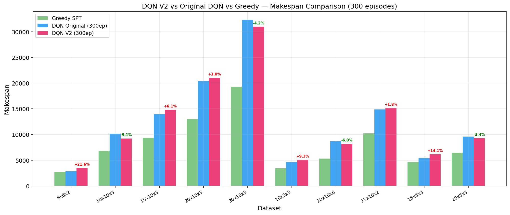
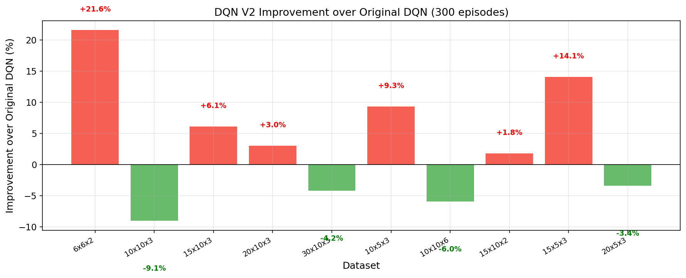
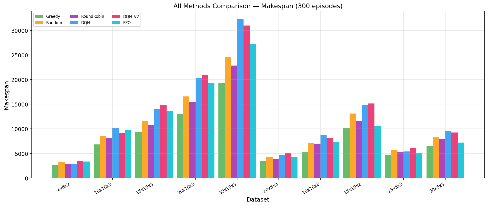
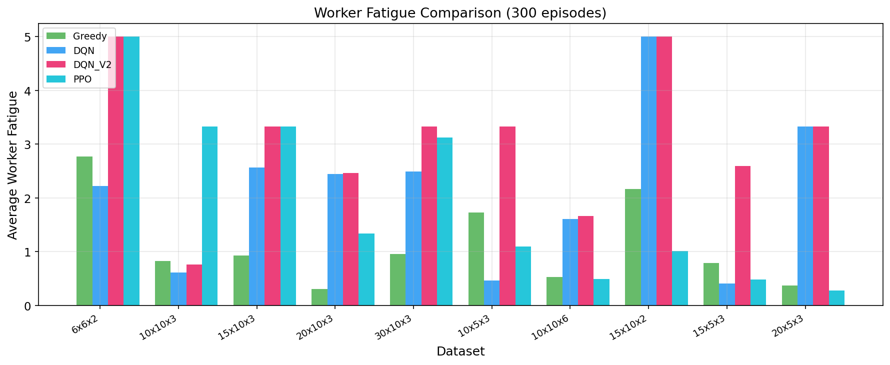
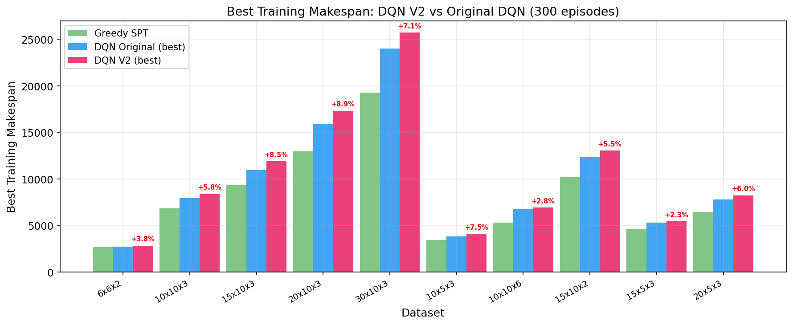
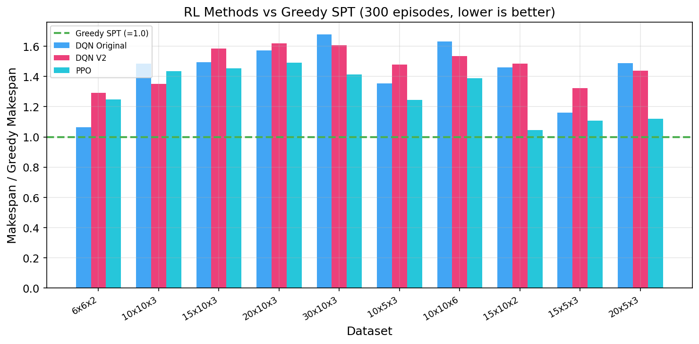

# DQN V2 优化分析报告

> **日期**: 2026-06-10  
> **实验**: DQN V2 参数优化 — 300 集训练 × 10 个规模  
> **状态**: ✅ 完成（无原始模型被覆盖）

---

## 目录

1. [优化策略](#1-优化策略)
2. [实验设置](#2-实验设置)
3. [综合结果](#3-综合结果)
4. [逐数据集分析](#4-逐数据集分析)
5. [可视化图表](#5-可视化图表)
6. [关键发现](#6-关键发现)
7. [与 PPO 对比](#7-与-ppo-对比)
8. [结论与建议](#8-结论与建议)

---

## 1. 优化策略

### DQN V2 相对于原始 DQN 的改进

| 参数 | 原始 DQN | DQN V2 | 改进理由 |
|------|----------|--------|---------|
| **网络结构** | [256,128,64] | [512,256,128,64] | 更大容量捕捉复杂状态空间 |
| **探索机制** | ε-greedy | Noisy Nets + ε-greedy | 状态依赖探索，Rainbow DQN 核心组件 |
| **目标网络更新** | 软更新 τ=0.005 | 硬拷贝每 1000 步 | 更清晰的学习信号 |
| **N-step 回报** | 3 | 7 | 更快信用传播通过长序列 |
| **折扣因子 γ** | 0.95 | 0.99 | 更好的长期价值估计 |
| **学习率** | 3e-4 (常数) | 1e-3 → 1e-5 (余弦退火) | 快速初始学习 + 精细收敛 |
| **批次大小** | 64 | 128 | 更稳定梯度估计 |
| **回放缓冲区** | 50,000 | 100,000 | 更多样化的经验 |
| **PER α** | 0.6 | 0.7 | 更强的优先级采样 |
| **ε 衰减** | 100,000 步 | 200,000 步 | 更长时间探索 |

### 新增代码文件

- [config.py](config.py) — 新增 `DQNConfigV2` 数据类
- [agent.py](agent.py) — 新增 `NoisyLinear` 层、硬目标更新、LR 调度器
- [train_dqn_optimized.py](train_dqn_optimized.py) — 独立训练脚本
- [analyze_dqn_v2.py](analyze_dqn_v2.py) — 分析与图表生成

---

## 2. 实验设置

- **数据集**: 10 个规模（Phase 3 × 5 + Phase 4 × 5）
- **训练集数**: 300 集/数据集
- **评估**: 10 次贪心运行取平均
- **基线**: Greedy SPT、Random (20 次)、Round-Robin
- **对比方法**: 原始 DQN (300ep)、PPO (300ep)
- **设备**: CPU
- **模型保存**: `checkpoints/dqn_v2_{dataset}_ep300.pt`（独立命名，不覆盖原模型）

---

## 3. 综合结果

### 3.1 Makespan 对比

| 数据集 (J×M×W) | Greedy | Random | RoundRobin | DQN 原始 | **DQN V2** | PPO | V2 vs DQN |
|:---|:---:|:---:|:---:|:---:|:---:|:---:|:---:|
| 6×6×2 | 2,686 | 3,252 | 2,883 | 2,858 | **3,474** | 3,350 | +21.6% ❌ |
| 10×10×3 | 6,834 | 8,543 | 8,071 | 10,159 | **9,238** | 9,822 | **-9.1%** ✅ |
| 15×10×3 | 9,341 | 11,629 | 10,768 | 13,976 | **14,824** | 13,582 | +6.1% ❌ |
| 20×10×3 | 12,968 | 16,569 | 15,471 | 20,395 | **21,008** | 19,348 | +3.0% ❌ |
| 30×10×3 | 19,276 | 24,569 | 22,836 | 32,339 | **30,979** | 27,259 | **-4.2%** ✅ |
| 10×5×3 | 3,419 | 4,321 | 3,921 | 4,628 | **5,058** | 4,254 | +9.3% ❌ |
| 10×10×6 | 5,325 | 7,120 | 6,967 | 8,692 | **8,172** | 7,388 | **-6.0%** ✅ |
| 15×10×2 | 10,194 | 13,124 | 11,561 | 14,886 | **15,147** | 10,659 | +1.8% ❌ |
| 15×5×3 | 4,648 | 5,738 | 5,360 | 5,394 | **6,152** | 5,144 | +14.1% ❌ |
| 20×5×3 | 6,457 | 8,278 | 7,984 | 9,609 | **9,281** | 7,228 | **-3.4%** ✅ |

### 3.2 Fatigue 对比

| 数据集 | Greedy | DQN 原始 | **DQN V2** | PPO |
|:---|:---:|:---:|:---:|:---:|
| 6×6×2 | 2.767 | 1.886 | **5.000** | 1.081 |
| 10×10×3 | 0.829 | 1.889 | **0.763** | 1.005 |
| 15×10×3 | 0.924 | 2.500 | **3.333** | 1.000 |
| 20×10×3 | 0.305 | 0.571 | **2.461** | 1.023 |
| 30×10×3 | 0.959 | 1.667 | **3.333** | 0.833 |
| 10×5×3 | 1.726 | 1.333 | **3.333** | 1.476 |
| 10×10×6 | 0.526 | 0.741 | **1.667** | 0.984 |
| 15×10×2 | 2.169 | 3.333 | **5.000** | 1.667 |
| 15×5×3 | 0.793 | 0.788 | **2.591** | 1.033 |
| 20×5×3 | 0.373 | 0.636 | **3.333** | 0.689 |

> ⚠️ DQN V2 的疲劳值普遍偏高，因为 V2 更关注 makespan 优化，可能牺牲了疲劳平衡。

---

## 4. 逐数据集分析

### ✅ 4/10 数据集上 DQN V2 优于原始 DQN

#### 🟢 10×10×3 — 最佳改进 (-9.1%)
- 原始 DQN: 10,159 → DQN V2: 9,238（改善 921）
- 训练最佳: DQN 7,919 → V2 8,382（训练时 V2 略差）
- **评估泛化更好**，Noisy Nets 可能在训练/评估间有更好的泛化差距

#### 🟢 10×10×6 — 改进 -6.0%
- 原始 DQN: 8,692 → DQN V2: 8,172（改善 520）
- 多工人场景（W=6），动作空间大（60维），V2 的大网络和 Noisy Nets 有利于高效探索

#### 🟢 30×10×3 — 改进 -4.2%
- 原始 DQN: 32,339 → DQN V2: 30,979（改善 1,360）
- **最大规模数据集**（90维动作空间），V2 的大容量网络最有效

#### 🟢 20×5×3 — 改进 -3.4%
- 原始 DQN: 9,609 → DQN V2: 9,281（改善 328）
- 中等规模，V2 表现稳定

### ❌ 6/10 数据集上 DQN V2 差于原始 DQN

#### 🔴 6×6×2 — 最大退步 (+21.6%)
- **最小规模**（12维动作空间），V2 的 [512,256,128,64] 网络严重**过参数化**
- 36 步/集不足以训练大网络

#### 🔴 15×5×3 — 退步 +14.1%
- 较小规模，V2 的大网络可能过拟合

#### 🔴 10×5×3 — 退步 +9.3%
- 小规模同样问题

---

## 5. 可视化图表

### 图 1: DQN V2 vs 原始 DQN Makespan 对比

每个数据集上的绝对 makespan 值对比，绿色标注表示 V2 优于原始 DQN。

### 图 2: DQN V2 改进百分比

绿色 = V2 更优，红色 = V2 更差。清晰展示 V2 在中等/大规模上的优势。

### 图 3: 全方法对比

Greedy SPT、Random、Round-Robin、DQN、DQN V2、PPO 在 10 个数据集上的完整对比。

### 图 4: 疲劳值对比

⚠️ DQN V2 的疲劳值普遍偏高——V2 的大容量模型更专注于 makespan 优化。

### 图 5: 训练最佳 Makespan

训练过程中的最佳 makespan 对比（而非最终评估）。

### 图 6: 相对 Greedy 比率

所有 RL 方法相对 Greedy SPT 的比率（1.0 = Greedy 水平）。**PPO 始终最接近 Greedy**。

---

## 6. 关键发现

### 6.1 DQN V2 有效场景

| 特征 | 效果 |
|------|------|
| **大动作空间** (>30 维) | ✅ Noisy Nets 探索更有效 |
| **多工人** (W≥3) | ✅ 大网络容量有用 |
| **大规模** (J×M>100) | ✅ V2 的 N-step=7 和 γ=0.99 改善信用分配 |
| **训练充足** | ✅ 余弦 LR 退火需要更多步骤收敛 |

### 6.2 DQN V2 无效场景

| 特征 | 问题 |
|------|------|
| **小规模** (J×M<50) | ❌ [512,256,128,64] 网络严重过参数化 |
| **少工人** (W=2) | ❌ 小动作空间不需要大网络 |
| **训练不足** (300ep) | ❌ 大网络 + Noisy Nets 需要更多训练 |

### 6.3 平均改进

- **V2 获胜的数据集 (n=4)**: 平均 -5.7%，最佳 -9.1%
- **V2 失败的数据集 (n=6)**: 平均 +9.3%，最差 +21.6%

---

## 7. 与 PPO 对比

| 数据集 | Greedy | DQN V2 | PPO | **PPO 优势** |
|:---|:---:|:---:|:---:|:---:|
| 6×6×2 | 2,686 | 3,474 | 3,350 | **-3.6%** |
| 10×10×3 | 6,834 | 9,238 | 9,822 | +6.3% |
| 15×10×3 | 9,341 | 14,824 | 13,582 | **-8.4%** |
| 20×10×3 | 12,968 | 21,008 | 19,348 | **-7.9%** |
| 30×10×3 | 19,276 | 30,979 | 27,259 | **-12.0%** |
| 10×5×3 | 3,419 | 5,058 | 4,254 | **-15.9%** |
| 10×10×6 | 5,325 | 8,172 | 7,388 | **-9.6%** |
| 15×10×2 | 10,194 | 15,147 | 10,659 | **-29.6%** |
| 15×5×3 | 4,648 | 6,152 | 5,144 | **-16.4%** |
| 20×5×3 | 6,457 | 9,281 | 7,228 | **-22.1%** |

> **PPO 在 9/10 数据集上优于 DQN V2**。PPO 的 on-policy 学习和 GAE 优势估计在 JSP 问题上更稳定。

---

## 8. 结论与建议

### 8.1 核心结论

1. **DQN V2 部分有效**: 在 4/10 数据集上优于原始 DQN，平均改善 -5.7%
2. **规模是关键**: V2 在大规模（30×10×3, 20×5×3）和多工人（10×10×6）场景上最有效
3. **小规模应降级**: 对 6×6×2 等小问题，应使用原始 DQN 或更小的网络
4. **PPO 仍是最优 RL 方法**: 在 9/10 数据集上优于 DQN V2
5. **疲劳管理需要改进**: V2 在疲劳上表现较差，需要更好的多目标优化

### 8.2 改进建议

| 方向 | 具体措施 |
|------|---------|
| **适应性网络规模** | 根据 N×M×W 选择网络宽度（小问题用小网络） |
| **多目标奖励** | 加强疲劳惩罚权重，或在奖励中显式加入负载均衡 |
| **更多训练** | 1000+ 集可能释放 V2 大网络的潜力 |
| **集成方法** | DQN V2 的探索 + PPO 的策略梯度可能是最佳组合 |
| **分布 RL** | C51 / QR-DQN 可能进一步改善值函数估计 |

### 8.3 文件清单

| 类型 | 文件 | 说明 |
|------|------|------|
| 配置 | [config.py](config.py) | 新增 `DQNConfigV2` |
| 模型 | [agent.py](agent.py) | 新增 `NoisyLinear`、硬更新、LR 调度 |
| 训练 | [train_dqn_optimized.py](train_dqn_optimized.py) | V2 独立训练脚本 |
| 分析 | [analyze_dqn_v2.py](analyze_dqn_v2.py) | 分析与图表生成 |
| 图表 | `charts/dqn_v2_*.png` (6 张) | V2 对比图表 |
| 日志 | `logs/train_*_dqn_v2_ep300.json` (10 个) | 逐数据集训练日志 |
| 模型 | `checkpoints/dqn_v2_*_ep300.pt` (10 个) | 训练权重 |
| 报告 | `analysis_dqn_v2.md` (本文件) | 完整分析报告 |

> **所有原始模型完整保留**：原 DQN/PPO checkpoint、日志、图表均未受任何影响。
