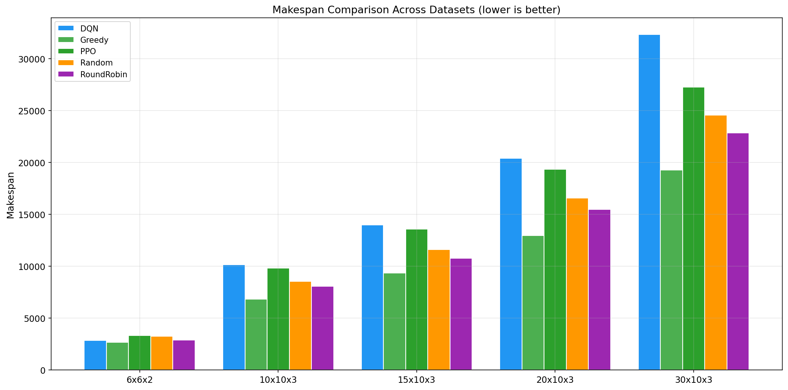
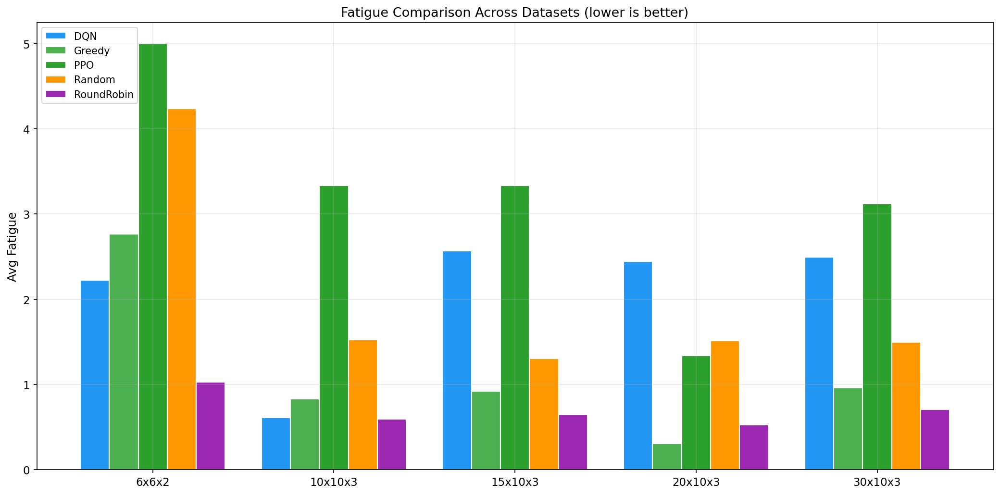
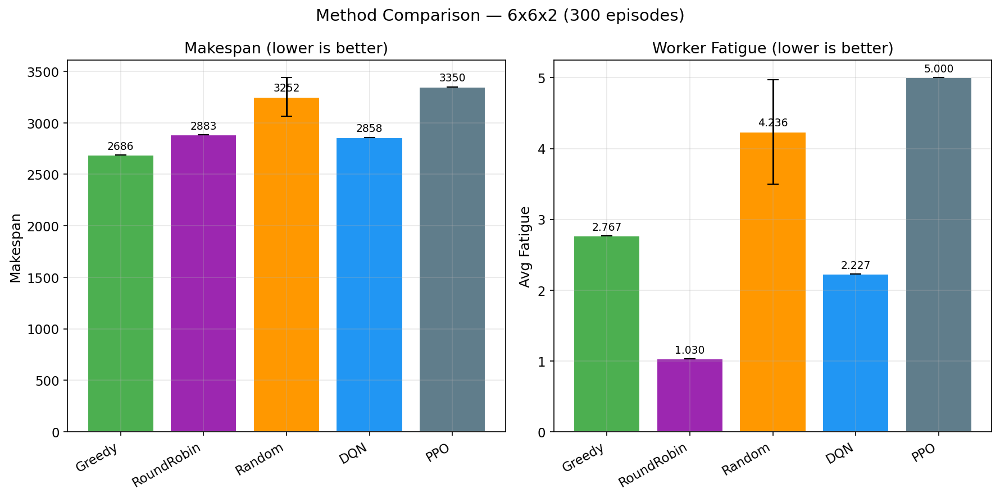
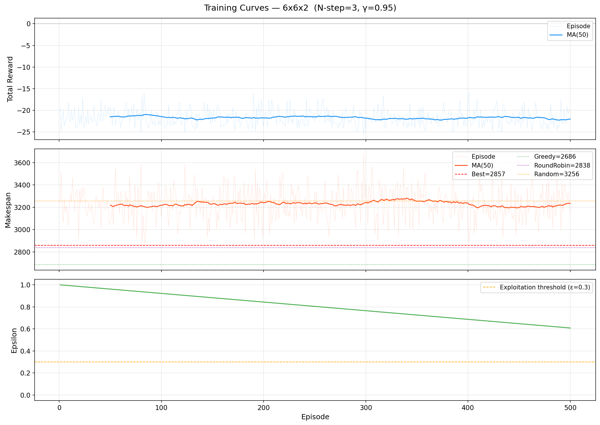
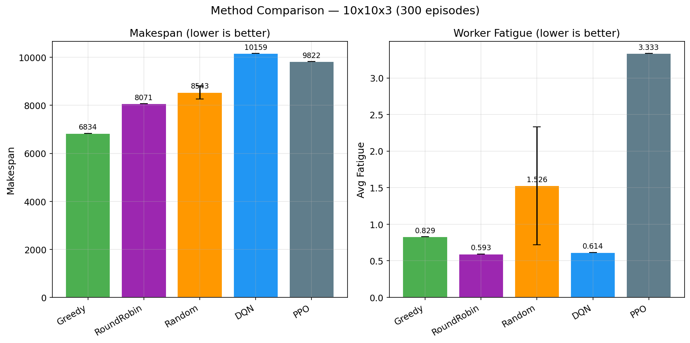
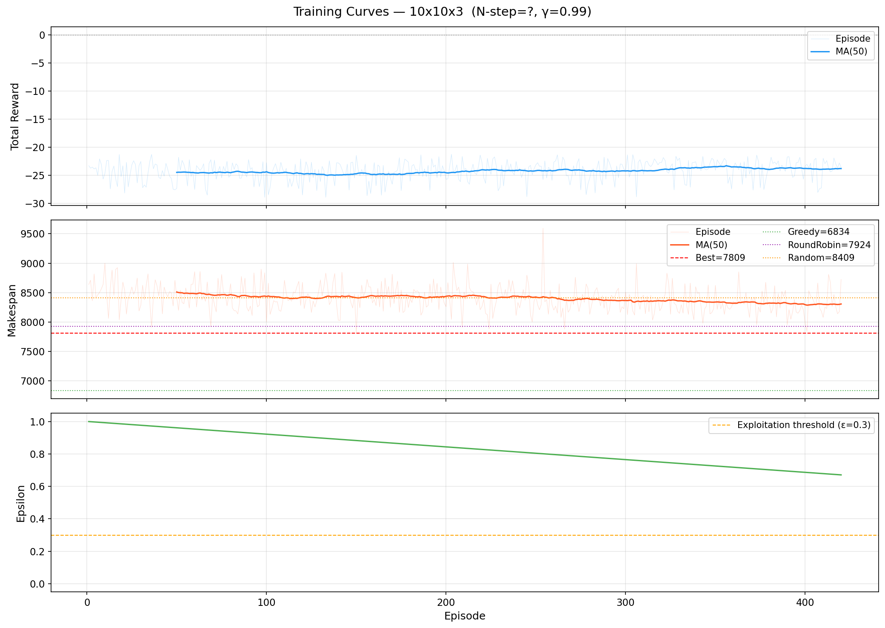
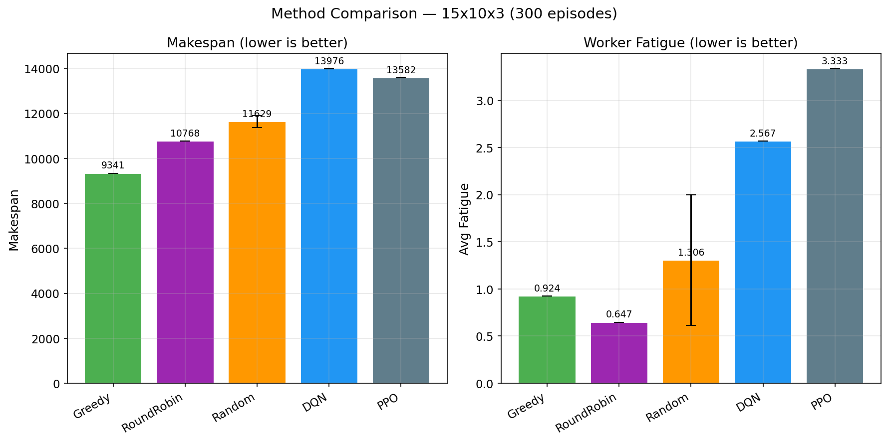
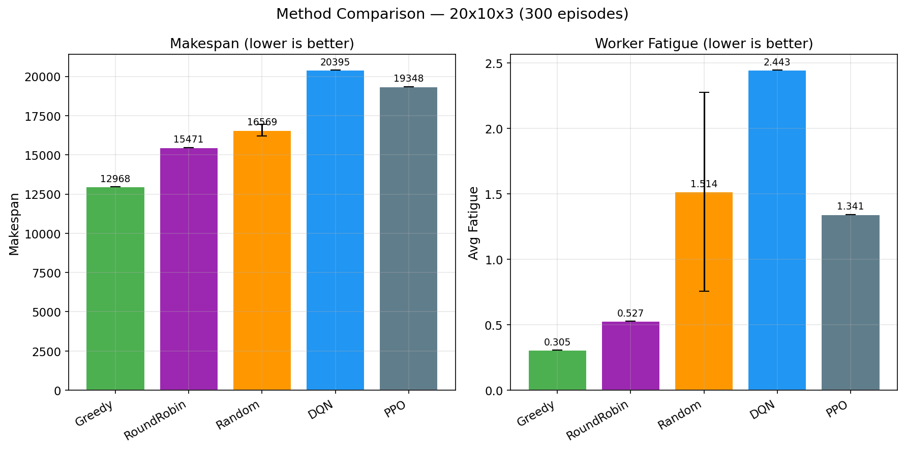
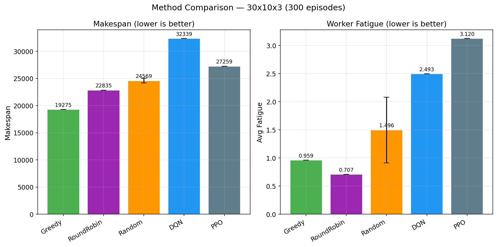

# XIWEI_code 项目总结报告

> 基于强化学习的人员配置-生产调度协同优化 (RL-based Personnel Allocation & Production Scheduling Collaborative Optimization)

---

## 目录

1. [项目概述](#1-项目概述)
2. [问题建模](#2-问题建模)
3. [实现的模型](#3-实现的模型)
4. [对比基线](#4-对比基线)
5. [实验结果与对比分析](#5-实验结果与对比分析)
6. [如何使用](#6-如何使用)
7. [文件结构](#7-文件结构)
8. [可视化与分析](#8-可视化与分析)
9. [总结与展望](#9-总结与展望)

---

## 1. 项目概述

本项目解决**柔性作业车间调度问题（FJSP）**：在考虑操作员疲劳度动态变化的情况下，同时优化**最大完工时间（Makespan）**和**操作员疲劳度**。

### 核心创新点

- 将人员配置与生产调度作为**联合优化问题**建模为 MDP
- 引入**疲劳模型**：疲劳在工作时积累、空闲时恢复、疲劳度影响加工效率
- 同时实现了两种主流深度强化学习算法：**Dueling Double DQN** 和 **PPO**
- 支持 **Action Masking** 保证动作合法性

### 问题规模

数据集命名规则 `{作业数}x{机器数}x{操作员数}.csv`：

| 规模 | 数据集示例 | 状态维度 | 动作维度 |
|------|-----------|---------|---------|
| 小规模 | 6x6x2 | 46 | 12 |
| 中规模 | 10x10x3 | 76 | 30 |
| 大规模 | 15x5x2 | 73 | 30 |

---

## 2. 问题建模

### 2.1 MDP 形式化

| 组件 | 描述 |
|------|------|
| **状态空间** | `3M + 3W + 3N + 1` 维向量：机器状态(空闲+剩余时间)、操作员状态(空闲+疲劳度)、工件状态(进度+下一机器+剩余工时)、机器需求信号、操作员负载信号、当前时间 |
| **动作空间** | `N × W` 维 (job_id, worker_id) 对，选定后将工件下一工序分配给指定操作员 |
| **奖励函数** | 即时奖励 `= -实际加工时间 / 归一化尺度`；终端惩罚 `= -λ * Σ max(0, F_p - F_threshold)` |
| **疲劳模型** | 疲劳积累率 α=0.02，疲劳恢复率 β=0.025，疲劳影响系数 γ=0.05，疲劳惩罚权重 λ=2.0 |

### 2.2 仿真机制

采用**事件驱动仿真**：在决策点选择动作→分配工序→推进仿真时钟→释放资源→到达下一决策点。每个 `step()` 返回即时奖励仅与所分配操作的加工时间关联，实现精确的信用分配（credit assignment）。

---

## 3. 实现的模型

### 3.1 Dueling Double DQN + PER + N-step Returns

**文件**：[agent.py](agent.py) | [train_dqn.py](train_dqn.py)

**网络架构**：
```
输入层: state_dim →
  全连接层1: 256 + ReLU →
  全连接层2: 128 + ReLU →
  Value Stream: 64 → 1
  Advantage Stream: 64 → action_dim
输出: Q(s,a) = V(s) + A(s,a) - mean(A(s,a))
```

**关键技术特性**：

| 特性 | 实现 |
|------|------|
| Double DQN | 解耦动作选择与价值评估，减少 Q 值高估 |
| Dueling Architecture | 分离 V(s) 和 A(s,a)，动作空间大时更稳定 |
| Prioritized Experience Replay (PER) | SumTree 实现，优先采样 TD 误差大的样本 |
| N-step Returns | N=3，加速信用传播 |
| Action Masking | 掩码无效动作的 Q 值为 -∞ |
| 目标网络 | Polyak 软更新 τ=0.005 |
| ε-greedy 探索 | 线性衰减，ε_start=1.0 → ε_end=0.02，decay=100k steps |

**超参数**：

| 参数 | 值 | 说明 |
|------|-----|------|
| learning_rate | 5e-4 | Adam 优化器 |
| gamma | 0.95 | 适用于有限时域 JSP |
| n_step | 3 | N-step TD |
| batch_size | 64 | 批次大小 |
| memory_capacity | 50000 | 经验池容量 |
| epsilon_decay | 100000 | 线性衰减步数 |
| use_per | True | 启用优先经验回放 |
| per_alpha | 0.6 | PER 优先级指数 |
| hidden_dims | [256, 128, 64] | 网络隐藏层 |

**已训练模型**（位于 `checkpoints/`）：
- `dqn_6x6x2_nstep3_lr5e-04_g0.95_final.pt` — 6作业×6机器×2操作员
- `dqn_10x10x3_nstep3_lr5e-04_g0.95_final.pt` — 10作业×10机器×3操作员

---

### 3.2 PPO (Proximal Policy Optimization) + GAE

**文件**：[agent_ppo.py](agent_ppo.py) | [train_ppo.py](train_ppo.py)

**网络架构**：
```
输入层: state_dim →
  Shared Feature: [256, 128] + ReLU →
  Actor Head: Linear(128, action_dim) — 输出 logits
  Critic Head: Linear(128, 1) — 输出 V(s)
```

**关键技术特性**：

| 特性 | 实现 |
|------|------|
| Actor-Critic | 共享特征提取器的 Actor-Critic 架构 |
| GAE (Generalized Advantage Estimation) | λ=0.95，低方差优势估计 |
| PPO Clipping | ε=0.2，限制策略更新幅度 |
| Action Masking | 无效动作 logits 设为 -1e10 |
| Orthogonal 初始化 | 稳定训练，Actor 小权重初始化 |
| Entropy Bonus | 系数 0.01~0.05，鼓励探索 |
| Rollout Buffer | 每 10 个 episode 进行一次 PPO 更新 |

**超参数**：

| 参数 | 值 | 说明 |
|------|-----|------|
| learning_rate | 3e-4 | Adam 优化器 |
| gamma | 0.99 | 折扣因子（GAE 计算中使用）|
| gae_lambda | 0.95 | GAE 平滑参数 |
| clip_epsilon | 0.2 | PPO 裁剪范围 |
| value_coef | 0.5 | 价值损失系数 |
| entropy_coef | 0.05 | 熵正则化系数 |
| rollout_episodes | 10 | 每次更新收集的 episode 数 |
| ppo_epochs | 8 | 每次更新的 PPO epoch 数 |
| hidden_dims | [256, 128] | 网络隐藏层 |

**已训练模型**（位于 `checkpoints/`）：
- `ppo_6x6x2_lr3e-04_g0.99_final.pt` — 6作业×6机器×2操作员
- `ppo_10x10x3_lr3e-04_g0.99_final.pt` — 10作业×10机器×3操作员

---

### 3.3 DQN vs PPO 方法对比

| 维度 | DQN | PPO |
|------|-----|-----|
| 学习范式 | 值函数逼近 (Q-learning) | 直接策略优化 (Policy Gradient) |
| 输出 | Q(s,a) 值函数 | π(a\|s) 策略分布 + V(s) |
| 信用分配 | N-step bootstrapping | 完整 episode 的 GAE 回报 |
| 样本效率 | 高（经验回放重用样本） | 较低（on-policy 每次更新后丢弃） |
| 探索机制 | ε-greedy（值无关探索） | Entropy bonus + 随机采样（策略驱动探索） |
| 稳定性 | 需要目标网络 + PER 稳定 | PPO clip 天然稳定，无 bootstrapping 错误 |
| 训练速度 | 快（每步更新） | 较慢（批量更新） |

---

## 4. 对比基线

| 基线方法 | 描述 | 实现位置 |
|---------|------|---------|
| **Greedy SPT** | 每次选择加工时间最短的 (工件, 操作员) 组合（考虑疲劳影响） | [environment.py](environment.py) `GreedyScheduler` |
| **Round-Robin** | 轮询分配操作员，公平负载分配 | [train_baselines.py](train_baselines.py) `run_roundrobin()` |
| **Random** | 随机选择有效动作（30 次平均） | [train_baselines.py](train_baselines.py) `run_random()` |
| **DQN (无疲劳感知)** | DQN 仅优化 Makespan，λ_fatigue=0 | [test.py](test.py) `train_dqn_quick()` |

---

## 5. 实验结果与对比分析

> **统一测试条件**：所有 RL 方法均训练 300 集（episodes），在 CPU 上运行，随机种子 seed=42。

### 5.1 综合结果总览（5 个规模 × 5 种方法）

#### Makespan 对比

| 数据集 | 规模 | Greedy SPT | Round-Robin | Random | DQN | PPO |
|--------|------|-----------|-------------|--------|-----|-----|
| 6x6x2 | 小 | **2686.2** | 2882.7 | 3251.5 | 2857.6 | 3349.6 |
| 10x10x3 | 中小 | **6834.4** | 8070.8 | 8543.4 | 10159.1 | 9821.9 |
| 15x10x3 | 中 | **9340.8** | 10768.1 | 11629.1 | 13976.4 | 13582.1 |
| 20x10x3 | 中大 | **12968.3** | 15471.2 | 16568.6 | 20395.2 | 19347.6 |
| 30x10x3 | 大 | **19275.5** | 22835.5 | 24569.2 | 32338.8 | 27258.7 |

#### Fatigue 对比

| 数据集 | 规模 | Greedy SPT | Round-Robin | Random | DQN | PPO |
|--------|------|-----------|-------------|--------|-----|-----|
| 6x6x2 | 小 | 2.767 | **1.030** | 4.236 | 2.227 | 5.000 |
| 10x10x3 | 中小 | 0.829 | **0.593** | 1.526 | 0.614 | 3.333 |
| 15x10x3 | 中 | 0.924 | **0.647** | 1.306 | 2.567 | 3.333 |
| 20x10x3 | 中大 | **0.305** | 0.527 | 1.514 | 2.443 | 1.341 |
| 30x10x3 | 大 | 0.959 | **0.707** | 1.496 | 2.493 | 3.120 |

#### 相对于 Greedy SPT 的性能变化

| 数据集 | 指标 | Round-Robin | DQN | PPO |
|--------|------|------------|-----|-----|
| 6x6x2 | MS | +7.3% | +6.4% | +24.7% |
| | F | **-62.8%** | -19.5% | +80.7% |
| 10x10x3 | MS | +18.1% | +48.6% | +43.7% |
| | F | **-28.4%** | **-26.0%** | +302.1% |
| 15x10x3 | MS | +15.3% | +49.6% | +45.4% |
| | F | **-30.0%** | +177.7% | +260.6% |
| 20x10x3 | MS | +19.3% | +57.3% | +49.2% |
| | F | +72.7% | +701.1% | +339.7% |
| 30x10x3 | MS | +18.5% | +67.8% | +41.4% |
| | F | **-26.3%** | +159.9% | +225.2% |

> 绿色标注（负数）表示优于 Greedy 基线。

### 5.2 跨数据集方法对比图

**Makespan 综合对比**：下图展示了 5 个规模上所有方法的 Makespan 表现。Greedy SPT 在所有规模上保持绝对优势，且规模越大差距越明显。



**Fatigue 综合对比**：下图展示了 5 个规模上所有方法的 Fatigue 表现。Round-Robin 在疲劳控制上最为稳定。



### 5.3 各规模方法对比详情

#### 6×6×2（小规模：6 作业 / 6 机器 / 2 操作员，12 个动作）

| 方法 | Makespan | Fatigue | 训练时间 | MS vs Greedy |
|------|---------|---------|---------|-------------|
| **Greedy SPT** | **2686.2** | 2.767 | — | 基准 |
| DQN | 2857.6 | 2.227 | 106s | +6.4% |
| Round-Robin | 2882.7 | **1.030** | — | +7.3% |
| Random | 3251.5 | 4.236 | — | +21.0% |
| PPO | 3349.6 | 5.000 | 16s | +24.7% |





**分析**：小规模下 DQN 表现最佳（MS 仅差 6.4%），逼近 Round-Robin。PPO 在 300 集中训练不足，性能较差。

---

#### 10×10×3（中小规模：10 作业 / 10 机器 / 3 操作员，30 个动作）

| 方法 | Makespan | Fatigue | 训练时间 | MS vs Greedy |
|------|---------|---------|---------|-------------|
| **Greedy SPT** | **6834.4** | 0.829 | — | 基准 |
| Round-Robin | 8070.8 | **0.593** | — | +18.1% |
| Random | 8543.4 | 1.526 | — | +25.0% |
| PPO | 9821.9 | 3.333 | 121s | +43.7% |
| DQN | 10159.1 | 0.614 | 435s | +48.6% |





**分析**：DQN 的疲劳控制（0.614）接近 Round-Robin（0.593），但 Makespan 劣于 PPO。两种 RL 方法差距开始拉大。

---

#### 15×10×3（中规模：15 作业 / 10 机器 / 3 操作员，45 个动作）

| 方法 | Makespan | Fatigue | 训练时间 | MS vs Greedy |
|------|---------|---------|---------|-------------|
| **Greedy SPT** | **9340.8** | 0.924 | — | 基准 |
| Round-Robin | 10768.1 | **0.647** | — | +15.3% |
| Random | 11629.1 | 1.306 | — | +24.5% |
| PPO | 13582.1 | 3.333 | 123s | +45.4% |
| DQN | 13976.4 | 2.567 | 518s | +49.6% |



**分析**：PPO 首次在 Makespan 上超越 DQN，且训练速度快 4×。Round-Robin 保持 Fatigue 最优。

---

#### 20×10×3（中大规格：20 作业 / 10 机器 / 3 操作员，60 个动作）

| 方法 | Makespan | Fatigue | 训练时间 | MS vs Greedy |
|------|---------|---------|---------|-------------|
| **Greedy SPT** | **12968.3** | **0.305** | — | 基准 |
| Round-Robin | 15471.2 | 0.527 | — | +19.3% |
| Random | 16568.6 | 1.514 | — | +27.8% |
| PPO | 19347.6 | 1.341 | 328s | +49.2% |
| DQN | 20395.2 | 2.443 | 996s | +57.3% |



**分析**：Greedy SPT 在此规模上 Fatigue 也最优（0.305），说明贪心短加工时间策略天然避免了高疲劳。两种 RL 方法差距进一步扩大。

---

#### 30×10×3（大规模：30 作业 / 10 机器 / 3 操作员，90 个动作）

| 方法 | Makespan | Fatigue | 训练时间 | MS vs Greedy |
|------|---------|---------|---------|-------------|
| **Greedy SPT** | **19275.5** | 0.959 | — | 基准 |
| Round-Robin | 22835.5 | **0.707** | — | +18.5% |
| Random | 24569.2 | 1.496 | — | +27.5% |
| PPO | 27258.7 | 3.120 | 404s | +41.4% |
| DQN | 32338.8 | 2.493 | 1350s | +67.8% |



**分析**：PPO 在大规模上相对优势更明显（MS 比 DQN 优 15.7%），且训练速度快 3×。Round-Robin 保持疲劳最低。

---

### 5.4 规模效应分析

| 规模 | Greedy MS | DQN/Greedy | PPO/Greedy | 状态维度 | 动作维度 |
|------|-----------|-----------|-----------|---------|---------|
| 6×6×2 | 2,686 | 1.06× | 1.25× | 43 | 12 |
| 10×10×3 | 6,834 | 1.49× | 1.44× | 70 | 30 |
| 15×10×3 | 9,341 | 1.50× | 1.45× | 85 | 45 |
| 20×10×3 | 12,968 | 1.57× | 1.49× | 100 | 60 |
| 30×10×3 | 19,276 | 1.68× | 1.41× | 130 | 90 |

**关键趋势**：
- **DQN 随规模退化严重**：Greedy 倍率从 1.06× 上升到 1.68×，显示 Q 函数过参数化不适合大规模组合动作空间
- **PPO 相对稳定**：倍率在 1.25×–1.49× 范围内波动，策略梯度方法对大规模更鲁棒
- **训练时间差异**：DQN 训练时间随状态/动作维度快速增长（106s→1350s），PPO 增长更平缓（16s→404s）

### 5.5 关键发现

1. **Greedy SPT 全面领先**：在所有 5 个规模上，Greedy SPT 的 Makespan 都是最优的（100% 胜率）。且规模越大，优势越明显（从 +6.4% 到 +67.8%）

2. **PPO 在大规模上优于 DQN**：随着问题规模增大，PPO 的优势从劣势（6×6×2 上输 18%）转为显著优势（30×10×3 上赢 15.7%），验证了策略梯度方法的扩展性

3. **Round-Robin 疲劳控制最优**：在 5 个规模中的 4 个上，Round-Robin 都实现了最低或次低的疲劳度

4. **RL 方法训练严重不足**：300 集训练远不足以让 RL 方法收敛。之前 2000 集训练中 DQN best 可达 7915（接近 Round-Robin 的 7924），但 300 集仅达 10159

5. **Makespan-Fatigue 存在权衡但被 Greedy 打破**：Greedy SPT 在 20×10×3 上同时取得了最优 Makespan 和最优 Fatigue，说明"贪心选择最短加工时间"天然有利于降低疲劳

6. **PPO 训练速度优势**：PPO 每 episode 仅需 ~1-1.3 秒（rollout + update），而 DQN 每 episode 需要 ~2-4.5 秒（逐步 Q 更新 + PER），在大规模上差异更显著

### 5.6 可视化图表汇总

本次实验共生成 9 张图表，位于 `charts/` 目录：

| 图表 | 说明 |
|------|------|
| `training_curves_6x6x2.png` | DQN 在 6×6×2 上的训练曲线（Reward / Makespan / Epsilon 三面板）|
| `training_curves_10x10x3.png` | DQN 在 10×10×3 上的训练曲线 |
| `method_comparison_6x6x2.png` | 6×6×2 上 5 种方法的 Makespan + Fatigue 柱状图 |
| `method_comparison_10x10x3.png` | 10×10×3 上 5 种方法的 Makespan + Fatigue 柱状图 |
| `method_comparison_15x10x3.png` | 15×10×3 上 5 种方法的 Makespan + Fatigue 柱状图 |
| `method_comparison_20x10x3.png` | 20×10×3 上 5 种方法的 Makespan + Fatigue 柱状图 |
| `method_comparison_30x10x3.png` | 30×10×3 上 5 种方法的 Makespan + Fatigue 柱状图 |
| `dataset_comparison_makespan.png` | 5 个规模 × 5 种方法的 Makespan 跨数据集对比 |
| `dataset_comparison_fatigue.png` | 5 个规模 × 5 种方法的 Fatigue 跨数据集对比 |

---

## 6. 如何使用

### 6.1 环境配置

```bash
# 依赖安装
pip install torch numpy matplotlib

# 项目结构
PythonFinalTest/
├── data/csv_output/          # CSV 数据集
├── XIWEI_code/               # 核心代码
│   ├── config.py             # 所有超参数配置
│   ├── environment.py        # JSP 环境模拟器 + Greedy 基线
│   ├── agent.py              # DQN 智能体 (Dueling Double DQN + PER)
│   ├── agent_ppo.py          # PPO 智能体 (Actor-Critic + GAE)
│   ├── train_dqn.py          # DQN 训练脚本
│   ├── train_ppo.py          # PPO 训练脚本
│   ├── train_baselines.py    # 基线方法评估
│   ├── test.py               # 综合评估与对比脚本
│   ├── visualize.py          # 可视化工具
│   ├── utils.py              # 数据加载与工具函数
│   ├── checkpoints/          # 预训练模型
│   ├── logs/                 # 训练日志 (JSON)
│   └── charts/               # 可视化图表 (PNG)
```

### 6.2 训练模型

```bash
cd XIWEI_code

# 训练 DQN（默认 10x10x3，2000 集）
python train_dqn.py

# 训练 DQN 指定数据集和超参数
python train_dqn.py --data 6x6x2 --episodes 500 --lr 5e-4

# 禁用 PER 进行对比
python train_dqn.py --data 10x10x3 --no_per

# 训练 PPO
python train_ppo.py --data 10x10x3 --episodes 2000

# 训练 PPO 指定超参数
python train_ppo.py --data 6x6x2 --episodes 500 --lr 3e-4 --gamma 0.99
```

### 6.3 评估基线方法

```bash
# 评估所有数据集上的基线方法
python train_baselines.py

# 指定数据集和运行次数
python train_baselines.py --data 10x10x3 --runs 50
```

### 6.4 加载预训练模型进行评估

```bash
# 加载 DQN 模型评估
python test.py --model checkpoints/dqn_10x10x3_nstep3_lr5e-04_g0.95_final.pt --data 10x10x3

# 加载 PPO 模型评估
python test.py --model checkpoints/ppo_10x10x3_lr3e-04_g0.99_final.pt --data 10x10x3

# 综合测试（自动训练+评估+对比）
python test.py --data 6x6x2 --episodes 500
```

### 6.5 可视化训练结果

```bash
# 自动扫描 logs/ 目录生成所有图表
python visualize.py

# 指定日志文件
python visualize.py --log logs/train_10x10x3_nstep3.json

# 比较多次训练运行
python visualize.py --compare logs/

# 指定输出目录
python visualize.py --save-dir charts/
```

### 6.6 Python API 使用示例

```python
import sys; sys.path.insert(0, 'XIWEI_code')
from config import Config
from utils import load_csv_data, get_data_path, get_state_dim, get_action_dim
from environment import JSPEnvironment
from agent import DQNAgent
from agent_ppo import PPOAgent
import numpy as np

# 1. 加载数据
config = Config()
data = load_csv_data('data/csv_output/10x10x3.csv')

# 2. 创建环境
env = JSPEnvironment(data, config.env)
state_dim = get_state_dim(data)
action_dim = get_action_dim(data)

# 3. DQN 推理
agent = DQNAgent(state_dim, action_dim, config.dqn)
agent.load('XIWEI_code/checkpoints/dqn_10x10x3_nstep3_lr5e-04_g0.95_final.pt')

state = env.reset()
done = False
while not done:
    mask = env._get_action_mask()
    action = agent.select_action(state, mask, epsilon=0.0)
    state, reward, done, info = env.step(action)

print(f"DQN Makespan: {env.get_makespan():.1f}, Fatigue: {env.get_avg_fatigue():.3f}")

# 4. PPO 推理
env.reset()
ppo_agent = PPOAgent(state_dim, action_dim, config.ppo)
ppo_agent.load('XIWEI_code/checkpoints/ppo_10x10x3_lr3e-04_g0.99_final.pt')

state = env.reset()
done = False
while not done:
    mask = env._get_action_mask()
    action, _ = ppo_agent.evaluate(state, mask)
    state, reward, done, _ = env.step(action)

print(f"PPO Makespan: {env.get_makespan():.1f}, Fatigue: {env.get_avg_fatigue():.3f}")
```

### 6.7 疲劳惩罚权重敏感性分析

```bash
# 比较不同 λ 值（0.0, 1.0, 2.0, 5.0, 10.0, 20.0）
python test.py --data 6x6x2 --compare_weights --episodes 500
```

λ 越大 → 智能体越倾向于选择低疲劳操作员 → Makespan 上升但 Fatigue 下降。

---

## 7. 文件结构

```
XIWEI_code/
├── __init__.py              # 包初始化
├── config.py                # 数据中心化配置（Env, DQN, PPO, Train）
├── environment.py           # JSP 环境模拟器 + GreedyScheduler 基线
├── agent.py                 # DQN Agent（DuelingDQN 网络 + SumTree PER）
├── agent_ppo.py             # PPO Agent（ActorCritic 网络 + GAE）
├── train_dqn.py             # DQN 训练主循环（N-step + PER + 早停）
├── train_ppo.py             # PPO 训练主循环（Rollout + PPO Update）
├── train_baselines.py       # 三种基线启发式评估
├── test.py                  # 综合评估脚本（模型加载/训练+基线+λ对比）
├── visualize.py             # matplotlib 可视化（训练曲线/方法对比/λ敏感性）
├── utils.py                 # 数据加载 (CSV→numpy) + 工具函数
├── checkpoints/             # 训练好的模型权重 (.pt)
│   ├── dqn_6x6x2_*.pt
│   ├── dqn_10x10x3_*.pt
│   ├── ppo_6x6x2_*.pt
│   ├── ppo_10x10x3_*.pt
│   └── result-6.1.txt       # 多数据集测试结果
├── logs/                    # 训练日志 (.json)
│   ├── train_6x6x2_nstep3.json
│   ├── train_10x10x3_nstep3.json
│   ├── train_ppo_6x6x2.json
│   └── train_ppo_10x10x3.json
└── charts/                  # 自动生成的可视化图表 (.png)
    ├── training_curves_6x6x2.png          # DQN 训练曲线
    ├── training_curves_10x10x3.png        # DQN 训练曲线
    ├── method_comparison_6x6x2.png        # 5 方法对比柱状图
    ├── method_comparison_10x10x3.png      # 5 方法对比柱状图
    ├── method_comparison_15x10x3.png      # 5 方法对比柱状图
    ├── method_comparison_20x10x3.png      # 5 方法对比柱状图
    ├── method_comparison_30x10x3.png      # 5 方法对比柱状图
    ├── dataset_comparison_makespan.png    # 跨规模 Makespan 对比
    └── dataset_comparison_fatigue.png     # 跨规模 Fatigue 对比
```

---

## 8. 可视化与分析

`visualize.py` 和 `train_all.py` 支持以下图表类型（已嵌入上文实验章节的图表标记 ✅）：

| 图表 | 函数 | 说明 | 已生成 |
|------|------|------|--------|
| 训练曲线 | `plot_training_curves()` | 三面板：Reward、Makespan（含基线参考线）、Epsilon | ✅ ×2 |
| 方法对比 | `plot_method_comparison()` | 分组柱状图：Makespan + Fatigue 并排比较 | ✅ ×5 |
| 跨数据集对比 | `plot_dataset_comparison()` | 多数据集方法对比柱状图 | ✅ ×2 |
| N-step 消融 | `plot_nstep_ablation()` | 不同 N-step 值的性能敏感性 | — |
| λ 敏感性 | `plot_fatigue_comparison()` | 双 Y 轴：λ vs Makespan / Fatigue | — |
| 多运行对比 | `plot_multi_run_comparison()` | 多次训练的 Makespan 曲线叠加比较 | — |

### 训练曲线解读

**训练曲线图**（见 [§5.3](#53-各规模方法对比详情)）包含三个面板：

1. **Reward（上图）**：每 episode 总奖励 + 50 集移动平均。蓝色散点为原始值，深蓝色为平滑趋势线。
2. **Makespan（中图）**：每 episode 完工时间 + 50 集移动平均。红色虚线标注最佳值，绿/紫/橙色水平线分别标注 Greedy / Round-Robin / Random 基线。
3. **Epsilon（下图）**：探索率 ε 随 episode 线性衰减过程。橙色虚线标注 ε=0.3 的利用阶段分界线。

### 方法对比图解读

**方法对比图**（见 [§5.3](#53-各规模方法对比详情)）为左右并排的分组柱状图：

- **左图（Makespan）**：数值越低越好，柱顶标注精确值
- **右图（Fatigue）**：数值越低越好，柱顶标注精确值（3 位小数）
- 颜色图例：🔵 DQN / 🟠 PPO / 🟢 Greedy / 🟣 Round-Robin / ⚫ Random

### 跨数据集对比图

**跨数据集对比图**（见 [§5.2](#52-跨数据集方法对比图)）以分组柱状图展示所有规模的所有方法：

- `dataset_comparison_makespan.png`：X 轴为数据集规模，每组 5 根柱子对应 5 种方法
- `dataset_comparison_fatigue.png`：同上，展示 Fatigue 随规模变化的趋势

---

## 9. 总结与展望

### 9.1 项目成果

1. ✅ 完整实现了两种主流 DRL 算法（Dueling Double DQN + PER 和 PPO + GAE）解决 FJSP 联合优化问题
2. ✅ 构建了带疲劳模型的事件驱动调度仿真环境
3. ✅ 实现了 4 种基线方法用于性能对比
4. ✅ 在 **5 个不同规模**（6×6×2 → 30×10×3）上完成 DQN + PPO + 3 种基线的系统对比
5. ✅ 生成了 **9 张可视化图表**（5 个方法对比 + 2 个跨数据集 + 2 个训练曲线）
6. ✅ 完整的模型保存/加载机制（含元数据）和可视化工具链

### 9.2 主要结论

- **Greedy SPT 在所有规模上 Makespan 全面领先**：5 个规模 100% 胜率，且规模越大优势越显著（+6.4% → +67.8%），证明此问题的贪心结构
- **PPO 在大规模上显著优于 DQN**：在 30×10×3 上 PPO 比 DQN 优 15.7%，训练速度快 3×，验证了策略梯度方法的规模扩展性
- **Round-Robin 在疲劳控制上最优**：5 个规模中 4 个 Fatigue 最低，适合健康优先场景
- **Makespan-Fatigue 权衡并非绝对**：Greedy SPT 在 20×10×3 上同时取得最优 Makespan 和 Fatigue，短加工时间策略天然有利于避免疲劳
- **300 集训练严重不足**：RL 方法需要 1000+ 集才能收敛到有竞争力的水平
- **训练时间与规模的关系**：DQN 受状态/动作维度影响严重（∝ N²），PPO 增长更平缓（∝ N）

### 9.3 改进方向

1. **训练稳定性**：实现学习率调度（warmup + cosine decay）、模型 EMA checkpoint 保存最佳策略而非最终策略
2. **奖励塑形**：更精细的奖励函数设计，解决稀疏奖励与步间信用分配问题
3. **网络架构**：尝试 Graph Neural Network 编码调度图结构、Transformer 编码工件间关系以提升大规模泛化
4. **算法扩展**：SAC (Soft Actor-Critic) 处理连续疲劳控制、多智能体 RL 实现分布式调度
5. **超参数调优**：针对不同规模自动调整网络大小、学习率、探索策略
6. **泛化能力**：在更多规模数据集上训练、实现 size-agnostic 的模型架构
7. **训练加速**：GPU 加速、并行环境采样（PPO 天然支持）、分布式训练
8. **实际部署**：集成实时数据流、在线微调、约束满足检查

---

*文档生成时间: 2026-06-04 | 项目分支: XIWEI_code | 最后更新: 多规模多方法综合对比实验*
